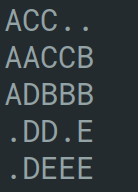

## Fillit
## 42 school's project

Program will take a file as parameter, which contains a list of Tetriminos, and arrange them in order to create the smallest square possible.

Program has own library, written by demands of school, and also has some limits.

Full project's task is in the file [**fillit.en.pdf**](fillit.en.pdf)
